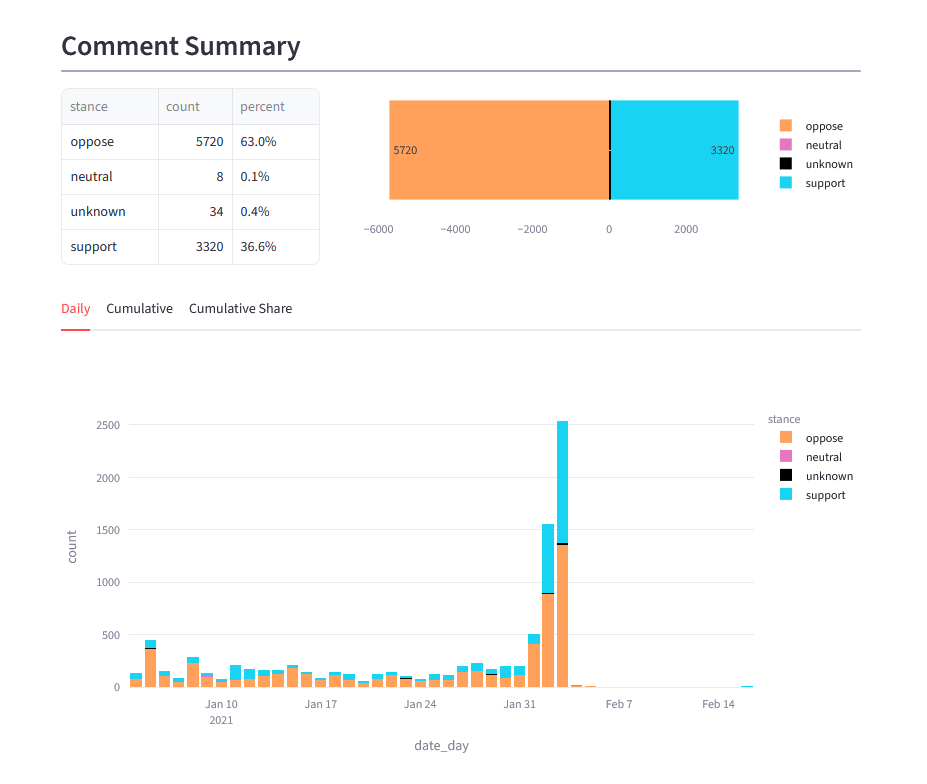
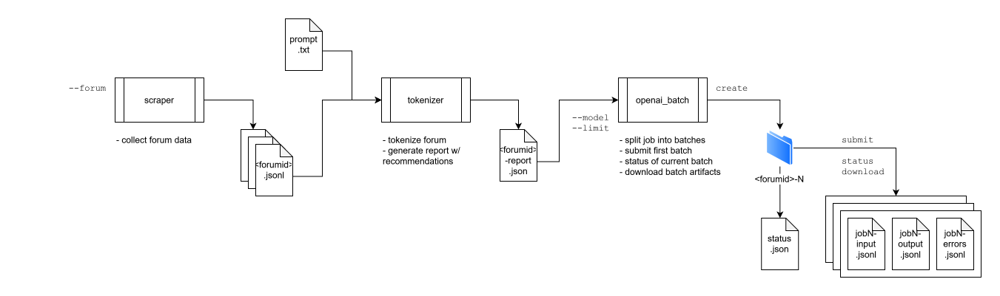

## Project Goals

1.  Document and analyze sentiment of public comments on Virginia law, to determine:
    1.  the utility of this forum as a mechanism for public comment, and
    2.  the impact of this forum on Virginia regulation.
2.  Make data and insights broadly available.
3.  Generalize to other public comment tools.

Take a look at https://vatownhall.streamlit.app



### Research questions

1.  What is the quality of the comments on the forum?
    1.  Are there duplicate entries?
    2.  Are there non-human-generated entries?
    3.  Are there entries intended to abuse the forum or drown out comment?
2.  How do commenters feel about the proposed change?
    1.  What is the total number and percent supporting vs opposing, and how does this change over time?
    2.  What is the type of support, such as strong/weak, positive/negative?
3.  What impact do the comments have on the proposed change?
    (I anticipate this will not be measurable from currently available data)


<a id="orgfabfcd9"></a>

## Architecture

1.  Scrape/Parse: Scrapy
2.  Sentiment analysis: gpt-5.4-mini
3.  Display: streamlit
4.  Storage: jsonl, csv, parquet




<a id="org2c5c7a2"></a>

### Scraper

Scrapy provides a simple mechanism for retrieving, parsing, and saving content form the forums.

1.  Forums listing page: `Forums.cfm` lists all open forums with agency, reg title, action type, brief description, closing date, comment count
2.  Comment listing page: `comments.cfm?GDocForumID=X` or `comments.cfm?stageid=X` or `comments.cfm?petitionid=X` lists comments with title, author, date
3.  Individual comment page: `viewcomments.cfm?commentid=X` shows regulation title + brief description at the top, plus the comment


<a id="org72990f4"></a>

### Analysis

Google and Amazon both return generic sentiment (tone of writing: positive/negative), not stance (for/against the regulation): "I strongly believe the government should NOT interfere" is negative tone but "against" the regulation.  We add the proposed change as context to the model.

Before sending the comments for sentiment analysis, `tokenizer.py` receives the forum to be processed and prompt as inputs, then generates a `report.json` estimating tokens (tiktoken), cost, and time to run for multiple models.

Then, the batch processing scripts uses the `report.json` to create multiple jobs, with subcommands to download and check their status. 

We selected gpt-5.4-mini for a good balance of quality, cost, and time.

1.  Prompt
    ```
    You are an expert policy analyst classifying public comments submitted to the Virginia Town Hall
    regulatory comment system. You will be given the text of a proposed regulation and a single
    public comment. Return ONLY a JSON object — no other text.
    
    Definitions:
    -   stance: the commenter's position on whether the regulation should be adopted.
        "support" = wants it approved (as-is or with changes);
        "oppose"  = wants it rejected or substantially weakened;
        "neutral" = takes no position, asks a question, or provides factual input only;
        "unknown" = too vague, off-topic, or uninterpretable to classify.
    -   tone: the emotional register of the writing, independent of stance.
        "positive" = affirming, hopeful, appreciative;
        "negative" = angry, fearful, alarmed, or contemptuous;
        "neutral"  = matter-of-fact, procedural, or informational;
        "mixed"    = contains both positive and negative emotional content;
        "unclear"  = tone cannot be determined (e.g., a one-word comment).
    -   stance_confidence: float 0.0-1.0, your confidence in the stance label.
    -   stance_rationale: 1-3 sentences explaining the key evidence; quote specific phrases where possible.
    -   tags: up to 5 short topic labels relevant to the comment's specific concerns (e.g.
        "parental rights", "student safety", "privacy", "religious freedom", "LGBTQ+ inclusion",
        "bullying prevention", "school sports", "bathroom access"). Empty array if none apply.
    
    Return exactly these keys: stance, stance_confidence, stance_rationale, tone, tags.
    ```


<a id="org58a5b72"></a>

### Storage

-   Each scraped forum is saved to `output/<forum-id>.jsonl`
-   Each report (forum + prompt) is saves to `reports/<forum-id-N>.json`
-   Each job is saved to `analysis/jobs/<report-id>`:
     └─`forum.jsonl` is a copy of the scraped forum for convenience  
     └─`prompt.txt` is a copy of the prompt used  
     └─`report.json` is a copy of the report used  
     └─`status.json` contains metadata about the job  
    For each batch in the job, four files are created:  
     └─`jobN-input.jsonl` contains the exact queries sent to the API, for troubleshooting  
     └─`jobN-output-raw.jsonl` contains the exact response from the API  
     └─`jobN-output.jsonl` contains the exact response from the API  
     └─`jobN-output-errors.jsonl` when errors are returned (this file may not exist)  
-   Once complete, the cleanup script saves `review.csv`, `review.pqt`, and `review.sqlite` in this folder.


<a id="org24fe465"></a>

## Instructions

1.  Scrape the forum.  
    `python`  
2.  Run model report.  
    `python analysis/tokenizer.py <input> --prompt <prompt>`  
3.  To run a realtime subset:  
    `python analysis/openai_realtime.py <input> --prompt <prompt> --model <model> --limit <N comments>`  
    `python analysis/openai_realtime.py output/f452.jsonl --prompt prompt-1.txt --model gpt-4o-mini --limit 10`  
4.  To create and run the whole thing in batches, first create the batch jobs from the report:  
    `python analysis/openai_batch.py create <report> --model <model>`  
    `python analysis/openai_batch.py create ./reports/f452-1.json --model gpt-5.4-mini`  
5.  Then, run the jobs sequentially. Don't submit more than one at a time, if the model fills up the batch will fail and resubmission is not implemented.  
    `python analysis/openai<sub>batch.py</sub> submit`  
    `python analysis/openai<sub>batch.py</sub> status`  
    `python analysis/openai<sub>batch.py</sub> download`  
    `python analysis/openai<sub>batch.py</sub> submit`  


<a id="org5739d49"></a>

# Roadmap

1.  Scrape one forum
2.  Compare sentiment models
3.  Display
4.  Scrape all data
5.  Scale?

